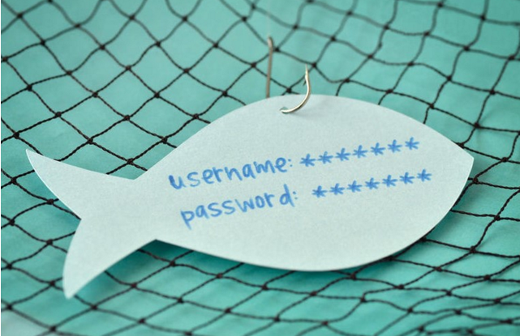

Phishing with tabnapping
==============

[Phishing](https://en.wikipedia.org/wiki/Phishing) is a type of social engineering, where the attacker sends a large number of fraudulent messages or e-mails, which seems like from banks or other well-known institutions with the intention to collect your sensitive information,such as username, password and account number

