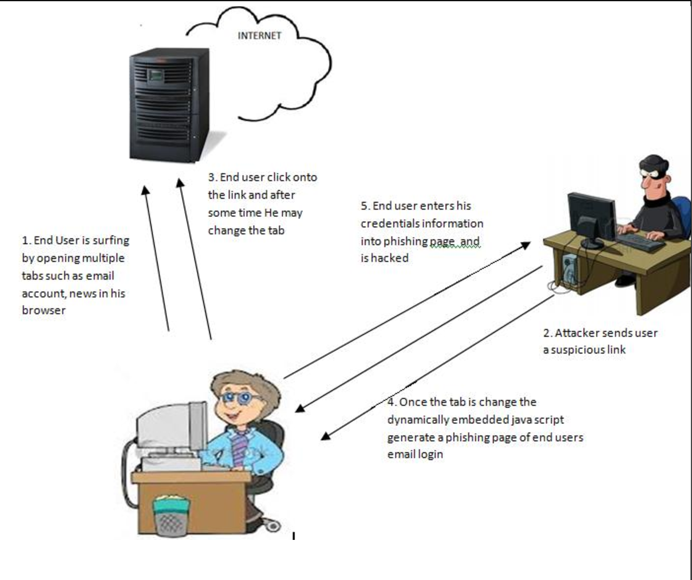
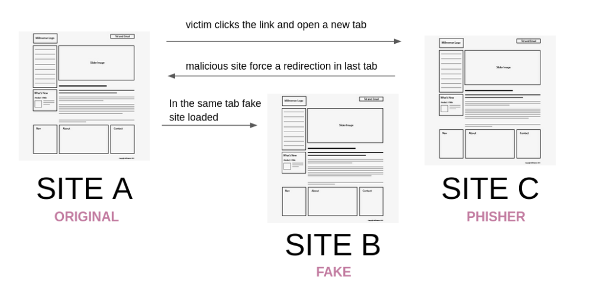

Phishing with tabnapping
==============

[Phishing](https://en.wikipedia.org/wiki/Phishing) is a type of social engineering, where the attacker sends a large number of fraudulent messages or e-mails, which seems like from banks or other well-known institutions with the intention to collect your sensitive information,such as username, password and account number

[Tabnabbing](https://en.wikipedia.org/wiki/Tabnabbing)is a type of phishing attack, which persuades users to submit their login details and passwords to popular websites by impersonating those sites and convincing the user that the site is genuine.The objective of tabnabbing is the same as traditional phishing, in which attackers link victims to their site via an email or link.
They hope that the target won’t notice the difference and will hand over their login details and other sensitive information believing that they are giving them to a legitimate site.

### How does Tabnabbing work
for example, there is a link on site A, the user click it,  and open a new tab ,this malicious site will force the original site  a redirection,because this two tabs are so similar,the user sees the login page may be induced to believe the page is legitimate and enter their login,and the attacker will obtain your sensitive information and that will be used for improper purpose.

### Who uses Tabnabbing
* Attackers
* Teachers
* Microsoft
* ...

### Why is Tabnabbing useful
People can take measures to avoid net fishing attempts and slightly modify their browsing habits. When contacting a letter or account number that requires you to "check your identity" (or the gist of any other letter used in phishing), it is wise to contact the company from which the letter is obviously sourced to check whether the email is legal. In addition, the address known to individuals is the real website of the company, which can be visited by entering in the website bar of the browser, rather than blindly believing the hyperlinks in any suspected fraud email. The anti phishing working group (apwg), an industry and law enforcement agency, suggests that traditional phishing fraud techniques may become obsolete in the future as people become more aware of the social engineering tricks used by net fishermen. They predict that website grafting and other use of rogue software will become common tools to steal information.

### What is the real-world impact
Almost all legal e-mails from companies to their customers contain at least one message that online fishermen don't have at hand. Some companies, such as PayPal, always address their customers by their customer user name in their e-mail, and so on. If the recipient of an e-mail is addressed in a common format (such as "Dear PayPal customer"), it is likely to be an attempt to fish online. Emails from banks and credit card companies often include part of the account number. However, recent research shows that the public usually does not distinguish between the first and last numbers of account numbers, which is a serious problem because the first few numbers are usually the same for all customers of a financial institution. People can be trained to raise their suspicions if the email does not contain any specific personal information. However, in early 2006, online fishing attempted to use personalized information, which made it unsafe to list personal information to ensure that the email was legal. In addition, another recent study concluded that listing personal information did not significantly affect the success rate of phishing attacks, indicating that most people did not pay attention to these details.

Demo/How to run this Demo
----
Demo is in ./phishing&tabnabbing/demo, which contains four html pages

Citations
---------
* https://en.wikipedia.org/wiki/Phishing
* https://en.wikipedia.org/wiki/Tabnabbing
* https://xz.aliyun.com/t/7080
